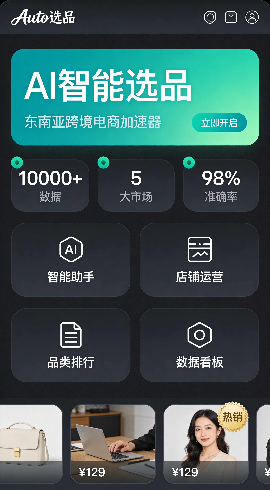
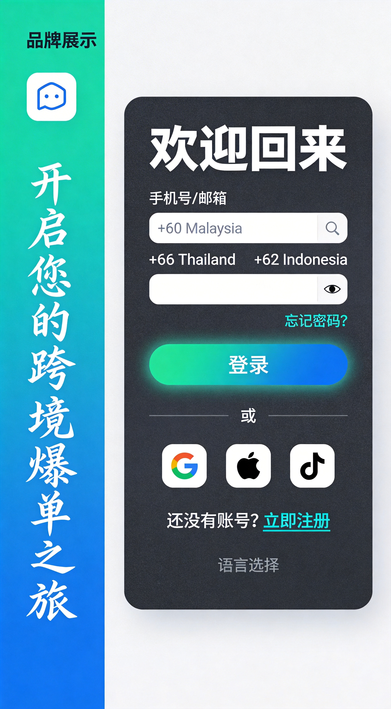
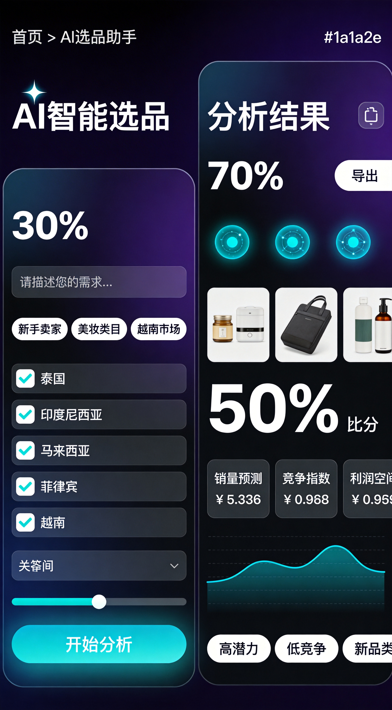
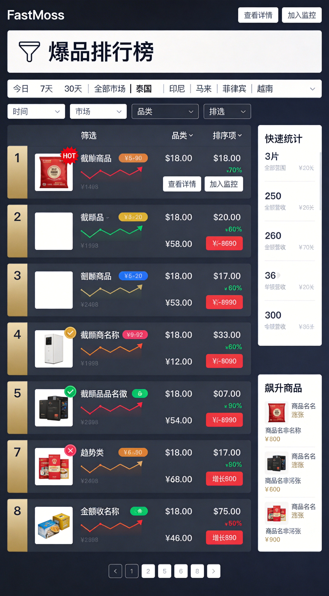
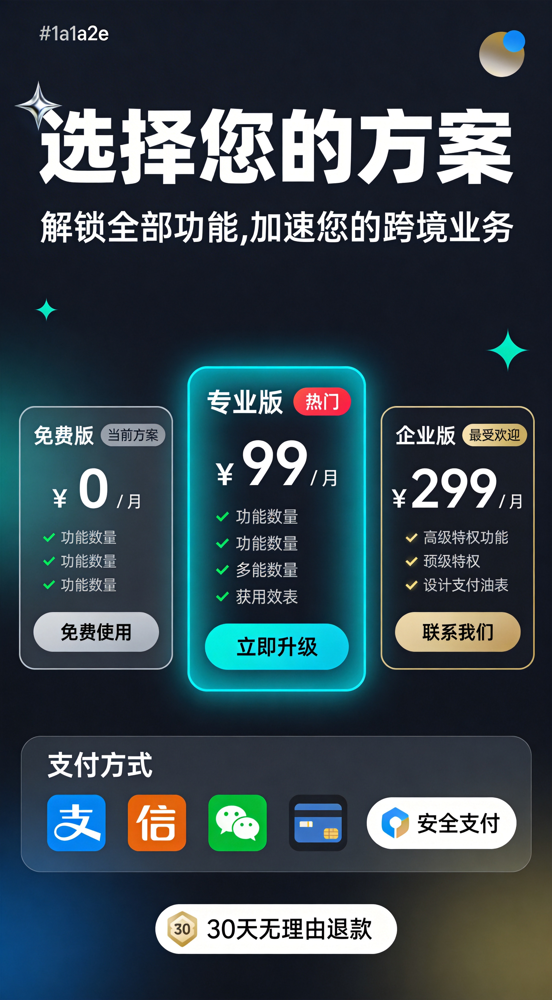

# Auto选品 UI设计交付文档 v1.0

## 📦 交付清单

### 1. 设计规范文档
| 文件 | 说明 | 路径 |
|-----|------|------|
| 设计规范文档.md | 完整设计系统定义 | `./项目文档/UI设计/设计规范文档.md` |
| 组件设计说明.md | 组件规范与使用指南 | `./项目文档/UI设计/组件设计说明.md` |

### 2. 页面设计稿（PNG格式）
| 序号 | 页面名称 | 文件名 | 说明 |
|-----|---------|--------|------|
| 01 | 首页 | `01_homepage.jpg` | 数据大屏风格，功能入口 |
| 02 | 登录/注册 | `02_login.jpg` | 简洁现代的认证页面 |
| 03 | AI选品助手 | `03_ai_assistant.jpg` | 核心功能页面 |
| 04 | 爆品排行榜 | `04_ranking.jpg` | 数据排行展示 |
| 05 | 套餐支付 | `05_pricing.jpg` | 定价页面 |
| 06 | 个人中心 | `06_profile.jpg` | 用户账户管理 |

---

## 🎨 设计系统摘要

### 色彩系统
```
主色系：
├── 深灰背景：#1a1a2e
├── 卡片背景：#16213e
├── 品牌主色：#0f9b8e (蓝绿)
├── 强调色：#f0c040 (金色)
└── 文字色：#ffffff / #8b8b9e

语义色：
├── 成功：#00c853
├── 警告：#f0c040
├── 错误：#e94560
└── 爆品：#f0c040
```

### 字体系统
```
主字体：Inter + 苹方
数据字体：JetBrains Mono
字号层级：10px / 12px / 14px / 18px / 24px / 32px
```

### 间距系统
```
基础单位：4px
常用间距：8px / 16px / 24px / 32px
```

### 圆角系统
```
小：4px → 中：8px → 大：12px → 特大：16px
```

---

## 📐 核心组件清单

| 组件类型 | 组件数量 | 覆盖范围 |
|---------|---------|---------|
| 按钮组件 | 4种 | 主按钮、次按钮、文字按钮、图标按钮 |
| 输入组件 | 3种 | 标准输入、图标输入、多行文本框 |
| 卡片组件 | 3种 | 标准卡片、数据卡片、产品卡片 |
| 徽章组件 | 2种 | 状态徽章、排名徽章 |
| 表格组件 | 2种 | 标准表格、移动端卡片列表 |
| 导航组件 | 3种 | 顶部导航、底部标签栏、标签切换 |
| 弹窗组件 | 3种 | 模态框、底部抽屉、Toast提示 |

**总计：20+组件**

---

## 📄 设计稿预览

### 首页 (01_homepage.jpg)

- 数据大屏风格
- 核心功能入口（2x2网格）
- 关键数据统计展示
- 热门商品轮播

### 登录/注册 (02_login.jpg)

- 左右分栏布局
- 多国家区号选择
- 社交登录支持

### AI选品助手 (03_ai_assistant.jpg)

- 左侧输入面板
- 右侧结果展示
- AI思考动画
- 数据可视化图表

### 爆品排行榜 (04_ranking.jpg)

- 多维度筛选器
- 排名表格/列表
- 趋势箭头指示
- 飙升商品速览

### 套餐支付 (05_pricing.jpg)

- 三栏定价卡片
- 推荐方案高亮
- 多种支付方式

### 个人中心 (06_profile.jpg)

- 会员状态展示
- 数据统计
- 邀请奖励
- 快捷功能入口

---

## 🔧 技术协作说明

### 与前端开发Bella的协作要点

1. **色彩变量定义**
   ```css
   :root {
     --color-primary: #0f9b8e;
     --color-secondary: #f0c040;
     --color-bg: #1a1a2e;
     --color-card: #16213e;
     --color-text: #ffffff;
     --color-text-secondary: #8b8b9e;
   }
   ```

2. **字体引入**
   ```html
   <link href="https://fonts.googleapis.com/css2?family=Inter:wght@400;500;600;700&family=JetBrains+Mono:wght@400;500&display=swap" rel="stylesheet">
   ```

3. **组件命名规范**
   - 使用BEM命名法：`block__element--modifier`
   - 组件前缀：`ui-` (ui-button, ui-card)

4. **响应式断点**
   ```css
   /* 移动端优先 */
   @media (min-width: 768px) { /* 平板 */ }
   @media (min-width: 1024px) { /* 桌面 */ }
   @media (min-width: 1440px) { /* 大屏 */ }
   ```

5. **动效建议**
   - 过渡时长：150ms（快）/ 250ms（标准）/ 400ms（慢）
   - 缓动函数：`cubic-bezier(0.16, 1, 0.3, 1)`

---

## 📋 后续计划

| 优先级 | 任务 | 状态 | 备注 |
|-------|------|------|------|
| P0 | 设计系统完善 | ✅ 完成 | 基础规范已定义 |
| P0 | 6个核心页面设计 | ✅ 完成 | PNG稿已交付 |
| P1 | 切图资源导出 | ⏳ 待开发 | 需Bella确认需求 |
| P1 | 动效设计补充 | ⏳ 待开发 | 可提供GIF示例 |
| P2 | Figma源文件 | ⏳ 待开发 | 如需可导出 |

---

## 📞 联系方式

- **设计负责人**：UI/UX Designer
- **协作前端**：Bella
- **项目仓库**：https://github.com/GitHub-0219/auto-selection

---

*文档版本：v1.0*
*交付日期：2024年*
*设计风格：专业数据风（TradingView/FastMoss）*
